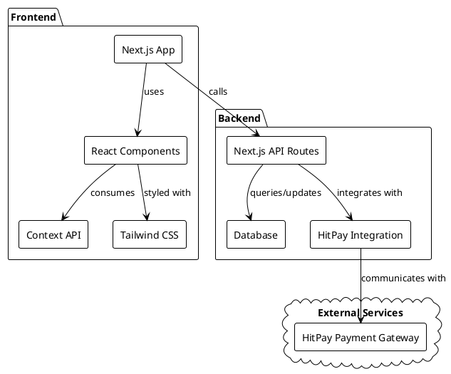
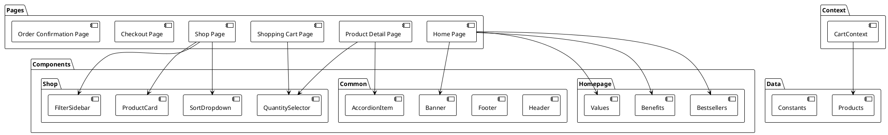
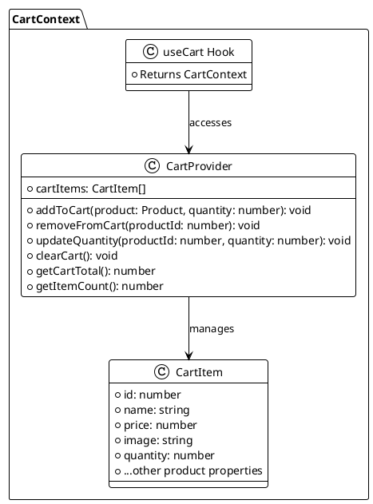
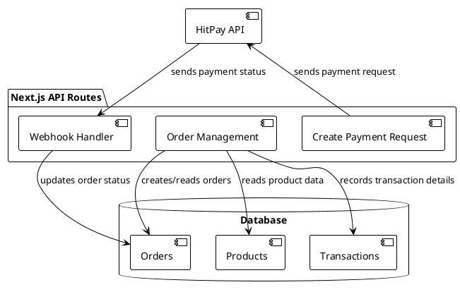
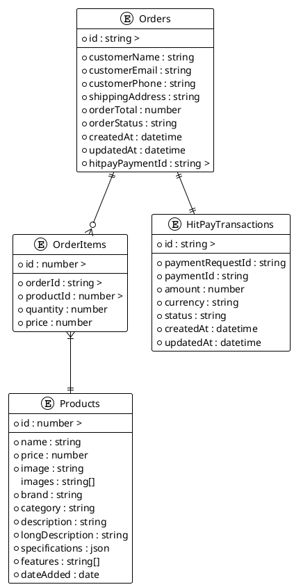
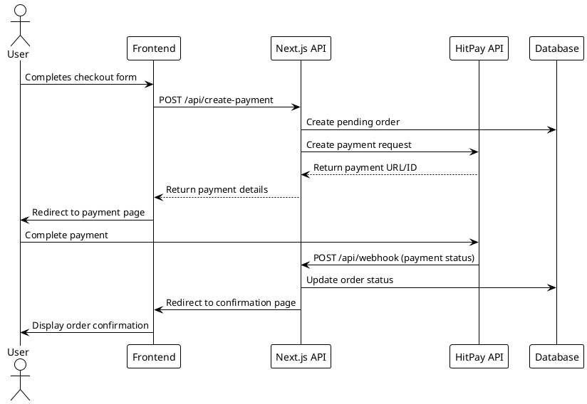
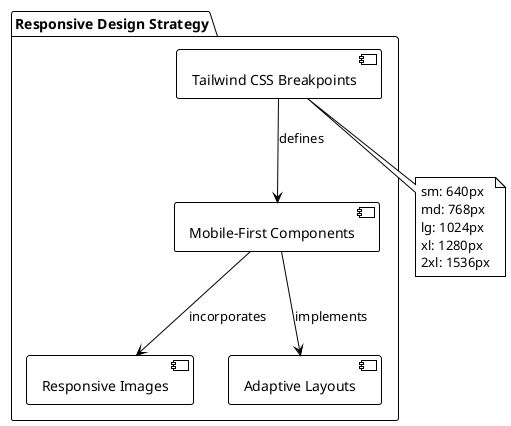
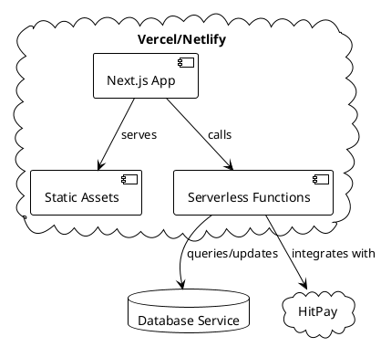
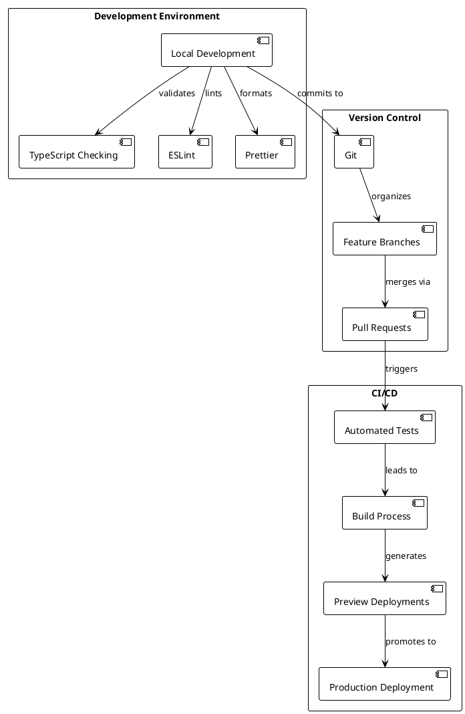

# Karvana E-Commerce Architecture Requirements Document

This document outlines the architectural design decisions for the Karvana E-Commerce platform, focusing on technical implementation details to guide development team members. The architecture is designed to support a clean, modern, and trustworthy online platform specializing in mobility products such as motorized wheelchairs and mobility scooters.

## System Overview

Karvana's e-commerce platform is built using a modern web stack with React and Next.js, focusing initially on desktop viewing experiences with future mobile responsiveness in mind. The system enables users to browse products, filter and search, view detailed product information, add items to cart, and complete purchases through a guest checkout flow integrated with HitPay payment processing.

### High-Level Architecture



## Technical Stack

The technical stack has been selected to provide a balance of modern development experience, performance, and maintainability:

| Component | Technology | Rationale |
|-----------|------------|-----------|
| Frontend Framework | React with Next.js | Provides server-side rendering, static site generation, and optimized client-side navigation |
| Programming Language | TypeScript | Type safety for improved developer experience and code quality |
| Routing | Next.js built-in router | Seamless integration with the Next.js framework |
| State Management | React Context API | Lightweight solution for global state needs (e.g., shopping cart) |
| Styling | Tailwind CSS | Utility-first approach for rapid UI development with consistent design |
| API Layer | Next.js API Routes | Serverless functions for backend logic, simplifying deployment |
| Database | TBD (PostgreSQL/MySQL/MongoDB) | Will be selected based on data structure needs |
| Payment Processing | HitPay | Singapore-based payment solution supporting multiple payment methods |
| Deployment | Vercel/Netlify | Optimized for Next.js applications |

## Frontend Architecture

### Component Structure

The frontend architecture follows a component-based design pattern with a clear separation of concerns:



### State Management

The application uses React Context API for global state management, particularly for the shopping cart functionality:



The cart state persists across sessions using browser localStorage, allowing users to maintain their cart items even if they close and reopen the browser.

## Backend Architecture

### API Routes

Next.js API routes serve as the backend for the application, handling server-side logic:



### Database Schema

While the current implementation uses mock data, the planned database schema will support the application's requirements:



## Payment Integration Architecture

The HitPay payment integration follows this flow:



## Data Flow Architecture

The overall data flow in the application follows this pattern:

```plantuml
@startuml
!theme plain
skinparam backgroundColor transparent

actor User
boundary "UI Components" as UI
control "Context API" as Context
control "Next.js API Routes" as API
entity "Database" as DB
boundary "HitPay" as HP

User -> UI : Interacts with UI
UI -> Context : Updates application state
Context -> UI : Renders updated state

UI -> API : Makes API requests
API -> DB : Queries/updates data
DB --> API : Returns data
API --> UI : Returns response

UI -> HP : Initiates payment
HP --> API : Sends webhook
API -> DB : Updates order status
DB --> UI : Updated order data
UI --> User : Shows confirmation

@enduml
```

## Responsive Design Strategy

While the initial focus is on desktop viewing, the architecture supports future mobile responsiveness:



## Deployment Architecture

The application is designed to be deployed on modern serverless platforms:



## Security Considerations

The architecture incorporates several security measures:

1. **Payment Security**: HitPay handles payment processing, reducing PCI DSS compliance requirements
2. **Data Protection**: Sensitive customer data is only stored when necessary
3. **API Security**: Next.js API routes validate requests and implement CORS policies
4. **Webhook Validation**: HitPay webhooks are validated using HMAC signatures

## Performance Optimization

Performance optimizations include:

1. **Server-Side Rendering**: Next.js provides SSR for improved initial page load
2. **Image Optimization**: Next.js Image component for automatic optimization
3. **Code Splitting**: Automatic code splitting for smaller bundle sizes
4. **Client-Side Navigation**: Fast page transitions without full page reloads
5. **Caching Strategy**: Leveraging browser caching and Next.js caching mechanisms

## Development Workflow



## Monitoring and Analytics

The architecture supports integration with monitoring and analytics tools:

1. **Error Tracking**: Integration with services like Sentry
2. **Performance Monitoring**: Core Web Vitals tracking
3. **User Analytics**: Integration with Google Analytics or similar
4. **Conversion Tracking**: Monitoring checkout funnel performance

## Future Extensibility

The architecture is designed to support future extensions:

1. **User Accounts**: Framework in place to add user authentication
2. **Product Management**: Expandable product data structure
3. **Internationalization**: Structure supports adding additional languages
4. **Mobile App**: Architecture compatible with React Native for future mobile app

## Conclusion

This architecture document provides a comprehensive technical blueprint for the Karvana E-Commerce platform. By following these architectural guidelines, the development team can ensure a consistent, maintainable, and scalable implementation that meets the business requirements while providing an excellent user experience.

The combination of React, Next.js, TypeScript, and Tailwind CSS provides a modern, performant foundation for the application, while the integration with HitPay ensures a secure and flexible payment solution. The component-based architecture promotes reusability and maintainability, and the serverless deployment model offers scalability and cost-efficiency.
